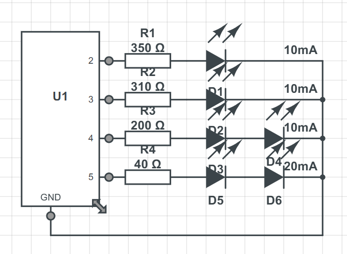

<!-- VK -->

# Příklady na resistory
*vycházíme z VA charakteristiky, kdy červená LED je na 10mA 1.5V, na 20mA 1.7V a zelená LED na 10mA 1.9V a na 20mA 2.1V*
1) K vývodu 2 je připojena červená LED, iF = 10 mA
    - $R_1 = 3.5V/0.01A = 350Ω$  

2) K vývodu 3 je připojena zelená LED, iF = 10 mA
   - $R_2 = 3.1V/0.01A = 350Ω$

3) K vývodu 4 jsou připojené 2 červené LED, iF = 10 mA
   - $R_3 = 2V/0.01A = 200Ω$

4) K vývodu 5 jsou připojené 2 zelené LED, iF = 20 mA
   - $R_4 = 0.8V/0.02A = 40Ω$  

